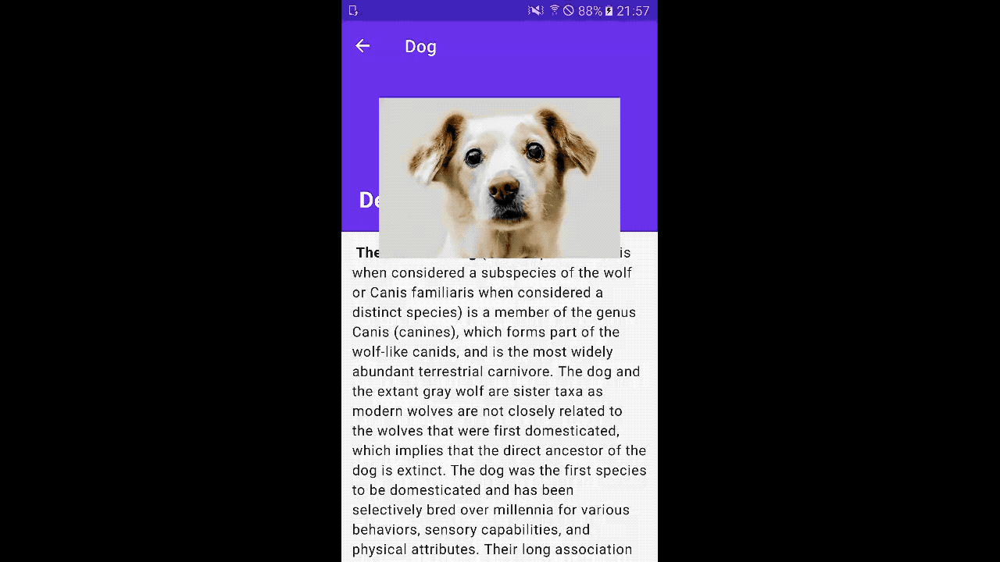

# Android fragment navigation - Shared elements & parallax scrolling
An android application that implements navigation & shared elements transition with Android Jetpack Navigation Component
## Getting Started
This sample uses the Gradle build system. To build this project, use the "gradlew build" command or use "Import Project" in Android Studio.

## Demo

